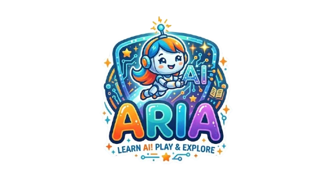

<p align="center">
  
</p>

<p align="center">
  <strong>An educational game that teaches kids (ages 8-16) how artificial intelligence really works.</strong>
</p>

<p align="center">
  
  
  
  
</p>

---

## The Story

The ISS Prometheus is in trouble. A cosmic storm has damaged **ARIA** (Adaptive Research Intelligence Agent) — the station's onboard AI. Players take on the role of a young cadet tasked with repairing ARIA module by module, learning real AI/ML concepts along the way.

## Missions

Each room on the station teaches a core AI concept through hands-on gameplay:

| Room | Mission | AI Concept | What You Do |
|------|---------|------------|-------------|
| Data Vault | Signal Classifier | Supervised Learning | Classify alien signals as friendly or hostile |
| Neural Core | Synaptic Wiring | Neural Networks | Adjust weights and biases to activate neurons |
| Sim Deck | Agent Navigator | Reinforcement Learning | Design environments and train ARIA to navigate |
| Optics Lab | Pattern Scanner | Computer Vision | Find hidden patterns in grids of symbols |
| Comms Array | Message Decoder | Natural Language Processing | Classify alien transmissions by intent |
| Ethics Chamber | Bias Detector | AI Fairness & Bias | Audit and fix biased AI decisions |
| Command Center | Finale | All Concepts | Bring ARIA fully online |

Every mission has **3 difficulty levels** — Tutorial, Challenge, and Mastery — with progressively harder mechanics and fewer hints.

## Features

- **6 interactive missions** covering supervised learning, neural networks, reinforcement learning, computer vision, NLP, and AI ethics
- **3 difficulty levels per mission** (18 playable levels total)
- **AI Codex** — collectible concept cards with real-world AI examples
- **Rank progression** — from Cadet Recruit to Prometheus Legend (10 ranks)
- **ARIA's story** — an evolving narrative with memory fragments and personality
- **Station hub** — PixiJS-rendered space station with room unlocks
- **Multilingual** — English, Arabic, and Hebrew with full RTL support
- **Achievement system** with XP tracking

## Tech Stack

| Technology | Purpose |
|-----------|---------|
| [React 19](https://react.dev) | UI components and state management |
| [PixiJS 8](https://pixijs.com) | Station hub canvas rendering |
| [Framer Motion](https://motion.dev) | Animations and transitions |
| [Howler.js](https://howlerjs.com) | Sound effects |
| [Vite](https://vite.dev) | Build tooling and dev server |

## Getting Started

```bash
# Install dependencies
npm install

# Start dev server
npm run dev

# Build for production
npm run build
```

## Project Structure

```
src/
  engine/       # PixiJS canvas and station hub renderer
  labs/         # Mission components (one per AI concept)
  locales/      # i18n translations (en, ar, he)
  systems/      # Game state, mission config, dialogue data, i18n
  ui/           # HUD, dialogues, codex, level select, briefings
public/
  logo.png      # ARIA logo
  fav.png       # Favicon
```

## License

MIT
